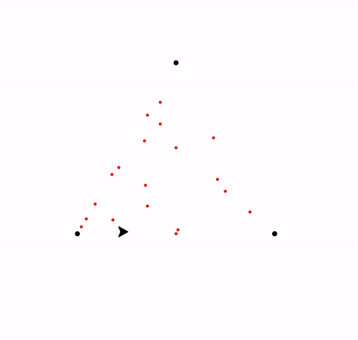
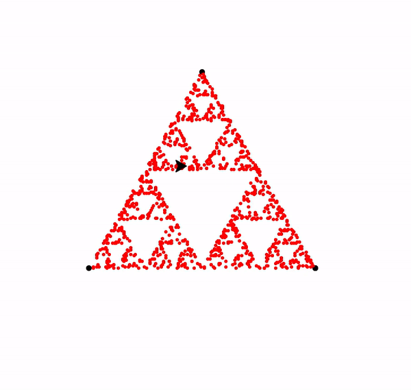

# TurtleFractals

Different Fractals using Python Turtle

## SierpińskiTriangle

The Sierpiński triangle, also called the Sierpiński gasket or Sierpiński sieve, is a fractal attractive fixed set with the overall shape of an equilateral triangle, subdivided recursively into smaller equilateral triangles.

